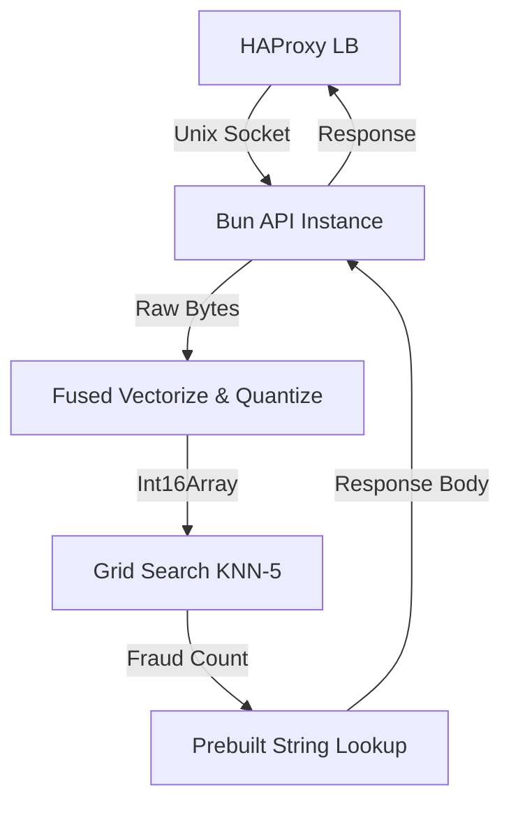

# Arquitetura do Sistema — Rinha 2026

## Fluxo de Dados (Hot Path)

## Componentes

### 1. Fused Vectorize & Quantize (`fast-json.ts`)
Responsável por transformar o buffer binário da requisição diretamente no vetor quantizado de 14 dimensões. 
- **Entrada:** `Uint8Array` (JSON bruto)
- **Saída:** `Int16Array` (Vetor quantizado)
- **Otimização:** Passagem única, zero alocação de heap, inlining de normalização.

### 2. Grid V2 Index (`grid-v2.ts`)
Estrutura de dados espacial otimizada que particiona o dataset em "bins" baseados nas dimensões de maior variância e seletividade (Valor da transação, Risco MCC e Distância da última transação).
- **Estrutura:** Flat arrays para minimizar cache misses.
- **Pruning:** Armazena BBoxes pré-calculadas para cada célula.

### 3. KNN Engine (`search-s3b.ts`)
Motor de busca de vizinhos mais próximos que opera sobre o Grid V2.
- **Algoritmo (S3B):** Best-first search via LB pruning com poda agressiva.
- **Inner Loop:** Distância euclidiana desenrolada (unrolled) para máxima eficiência JIT.

### 4. Load Balancer (HAProxy)
Configurado com `roundrobin` entre 2 instâncias da API, rodando em containers separados com limites de CPU rigorosos (0.45 por API, 0.10 LB).
